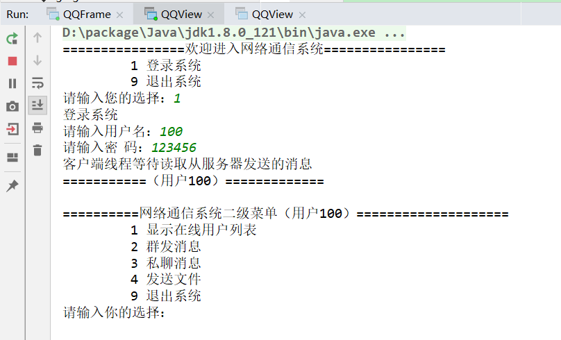
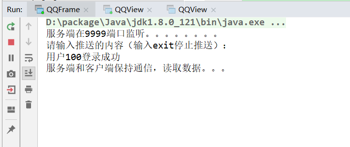

# 多线程网络通信系统

#### 基于Socket+多线程(Maven方式构建)

[](https://travis-ci.org/withstars/Books-Management-System)
[](https://github.com/withstars/Books-Management-System)

### 项目简介

本案例基于socket,多线程。模拟出QQ聊天的效果，实现发送私聊，文件，离线消息，推送新闻等功能。 

### 如何使用

```
QQItem --> 根项目，导入一些公共包
	QQClient --> 客户端 
	QQCommon --> 公共模块，定义了实体、枚举、工具类
	QQServer --> 服务端

项目启动：
	1. com.server.qqserver.frame.QQFrame 服务端main方法启动
	2. com.client.qqclient.view.QQView

```


### 部分截图



